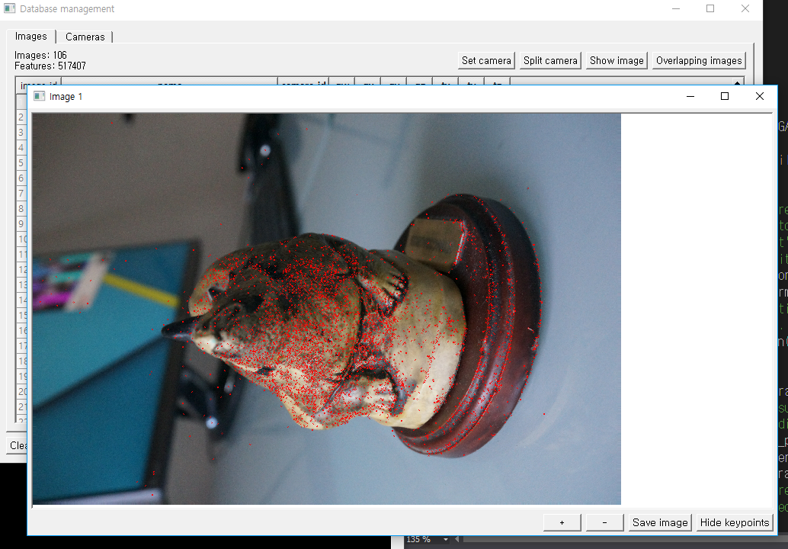
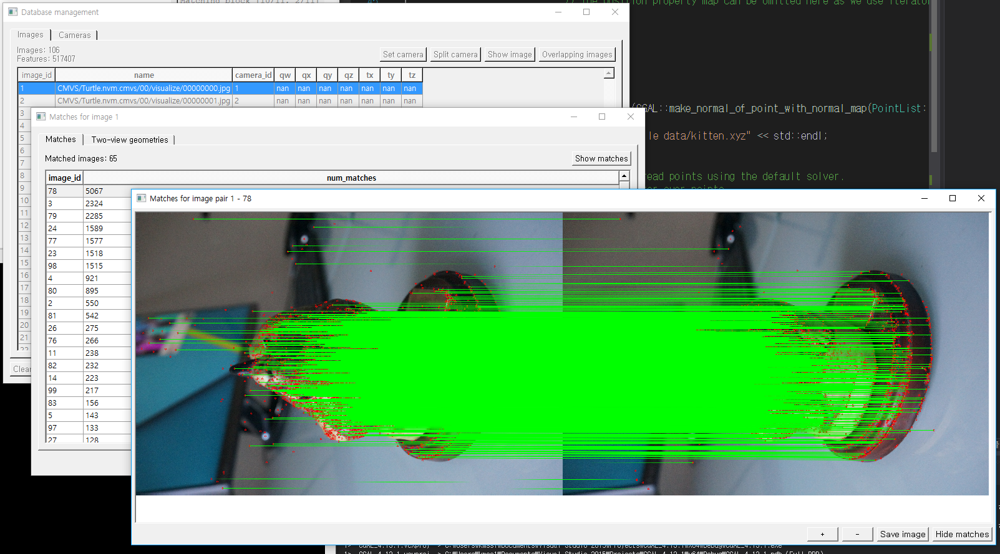
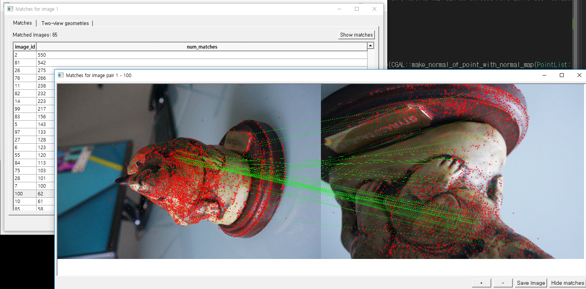

# Colmap-setup
Colmap을 세팅해 봅시다    
Reference : https://www.youtube.com/watch?v=P-EC0DzeVEU&t=183s    
Dataset : 
> Reference : https://peterfalkingham.com/2016/10/04/photogrammetry-testing-3-visualsfm-pmvs-meshlab/    
> Download LINK : http://bitly.kr/L28vC4

# 프로그램 설치
LINK : https://demuc.de/colmap/    
Release Version - 원하는 버전 다운로드 받아서 압축 해제.    
필자의 경우 COLMAP-3.5-windows.zip 를 받아 압축 해제 하였음

# 실행
COLMAP.bat 실행하면 된다.    
    
    

# 사용 방법
해당 프로그램은 여러 이미지들을 SfM 알고리즘을 사용하여 3D Point Cloud로 Reconstruction 하는 프로그램이다.    

### 프로젝트 생성
1. File - New Project 클릭 
2. New - Database를 저장할 원하는 경로에 Database 파일을 생성한다.     
3. Select - Image들이 저장된 폴더를 지정한다.
4. Save 버튼 클릭

### 이미지 별 Feature 추출
Processing - Feature Extraction를 클릭하여 이미지 간의 특징점들을 추출함    
    
> 실행 결과    
> 

### Feature 매칭
Processing - Feature Matching 을 클릭하여 각 Feature Point에 대해 유사한 Feature 들 끼리 묶어준다.    
Database Management를 이용하여 영 아닌 Feature 매칭 들에 대해서 삭제가 가능하다.
    
> 실행 결과    
    
>     
>     
> 각 매칭 결과도 그림으로 제공 해준다.    

### 3D Reconstruction
Reconstruction - Start Reconstruction 을 클릭하여 3D Point Cloud를 생성한다.    

# 실행 결과 및 구동 영상
    
> 

# ERROR

### non-OpenGL32.dll .....
이것도 그래픽 메모리할당 등으로 인해 그런 것 같다. 재부팅 후 다시 실행해 보자.
